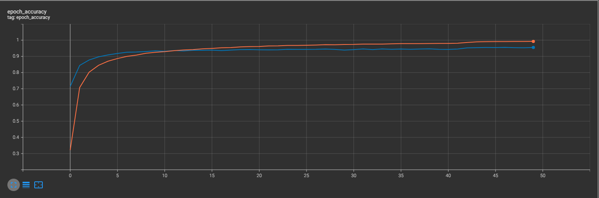
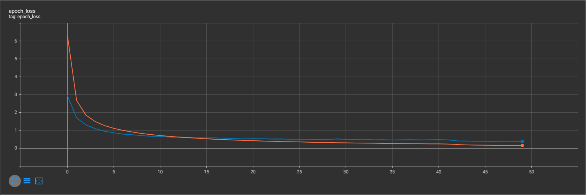
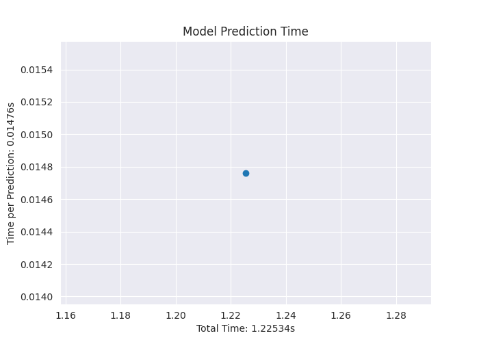

# Bird Species Classification with Deep Learning 🦜📊  

## Project Overview  
This project focuses on classifying **525 different bird species** using deep learning techniques. Bird classification presents a unique challenge due to the high similarity between species, requiring robust models and best practices to achieve optimal results.  

As part of my studies in **Artificial Intelligence and Machine Learning**, I developed this project to push my understanding of **computer vision and deep learning frameworks**. Additionally, it serves as a **portfolio project** to showcase my ability to tackle complex classification problems using **state-of-the-art techniques**.  

## Initial Model Experimentation  
To determine the most suitable architecture, I conducted an initial experiment comparing different deep learning models. The **Transfer Learning models** (EfficientNetB0, Xception, and ResNet50) were used as **feature extractors** (**Frozen Parameters**), and a **custom classification head** was added, consisting of:  
- A **fully connected layer** with **525 units** (one per bird species)  
- **Softmax activation** for multi-class classification  
- **Adam optimizer** with **learning rate = 1e-4**  
- **CategoricalCrossentropy** as the loss function  

| Model          | Validation Accuracy | Epoch Time (s) | Total Parameters | Trainable Parameters | Input Shape  |
|--------------|--------------------|----------------|------------------|---------------------|--------------|
| **EfficientNetB0** | **0.8715**         | 71             | 4,512,432        | 462,861             | (224, 224, 3) |
| Xception      | 0.7383              | 230            | 21,520,949       | 659,469             | (299, 299, 3) |
| ResNet50      | 0.7065              | 105            | 24,247,181       | 659,469             | (224, 224, 3) |
| BasicCNN      | 0.0197              | 77             | 25,918,541       | 25,918,541          | (224, 224, 3) |

From this initial comparison, **EfficientNetB0** emerged as the best-performing model, demonstrating the **highest validation accuracy** while maintaining a **relatively low number of parameters and training time**. Given its efficiency and accuracy, I selected **EfficientNetB0** as the backbone for further experimentation and hyperparameter tuning.  

## Motivation  
- **Challenging Problem:** Classifying **525 bird species** is non-trivial due to their visual similarities, requiring advanced deep learning techniques.  
- **Best Practices:** The complexity of this task demands the application of **best practices** in model selection, training, and optimization.  
- **Portfolio Project:** This project showcases my **expertise in deep learning** and my ability to apply it to real-world problems.  
- **Passion for AI & Deep Learning:** As a student of **AI and Machine Learning**, I am particularly interested in deep learning for computer vision applications.  

## Hyperparameter Optimization  
After selecting **EfficientNetB0** as the best-performing model, I conducted **hyperparameter tuning** to further optimize its performance. The tuning process focused on:  

- **Data augmentation** (Random Flip, Rotation, Brightness)  
- **Model architecture** (Number of dense layers, Number of units, Dropout rates)  
- **Optimizer selection** (Adam, RMSprop)  

### Hyperparameter Tuning Process  
Due to **limited computational resources**, I used **Keras Tuner's RandomSearch** instead of **Grid Search**, as an exhaustive search would have been too resource-intensive. The search was conducted with the following settings:  

- **Max Trials:** 30  
- **Executions per Trial:** 1  
- **Training Epochs per Trial:** 8  
- **Objective:** Validation Accuracy (`val_accuracy`)  
- **Search Space:**  
  - **Number of Dense Layers:** 0-2  
  - **Dense Layer Units:** 64-512  
  - **Dropout Rate:** 0.1-0.5  
  - **Data Augmentation:** Horizontal Flip, Rotation, Brightness  
  - **Optimizer:** Adam, RMSprop  

Each model was trained for only **8 epochs** without **callbacks** like **EarlyStopping** or **ReduceLROnPlateau**, again due to **hardware constraints**.  

### Key Findings  
Despite these limitations, the hyperparameter search provided several valuable insights:  

✅ **No additional dense layers** were needed beyond the final classification layer.  
✅ **Dropout was not necessary**, as it did not improve validation accuracy.  
✅ **Horizontal Flip** was the most effective augmentation method, while Rotation and Brightness did not provide significant improvements.  

### Recommendations for Further Optimization  
Since **RandomSearch** was used, it is likely that even better hyperparameters exist. With more computational resources, the following improvements could be made:  

- **Use Grid Search** to systematically explore all possible hyperparameter combinations.  
- **Increase the number of training epochs** to allow the model to converge better.  
- **Implement callbacks** such as:  
  - **EarlyStopping** (to prevent overfitting and stop training when improvement plateaus)  
  - **ReduceLROnPlateau** (to adjust the learning rate dynamically)  

These optimizations would likely lead to even **higher accuracy and better generalization** of the model. However, given the constraints, the chosen hyperparameters already provided **strong performance**.  

## Final Model Training  

After optimizing the hyperparameters, I experimented further to maximize the model's performance. The key improvements included:  

- **Unfreezing EfficientNetB0** to allow fine-tuning of its feature extractor.  
- **L2 Regularization** in dense layers to mitigate overfitting by penalizing complex parameters, encouraging simpler and more generalizable weights.  

### Model Performance  
I trained **four different models** and evaluated them on a **separate test dataset**. The results are summarized below:  

| Model | Accuracy | F1-Score (Weighted) | Precision (Weighted) | Recall (Weighted) |
|--------|------------|--------------------|----------------------|-------------------|
| 1      | **99.16%** | **99.14%**         | **99.32%**           | **99.16%**        |
| 2      | 98.90%     | 98.86%             | 99.12%               | 98.90%            |
| 3      | 98.44%     | 98.42%             | 98.80%               | 98.44%            |
| 4      | 98.78%     | 98.77%             | 99.02%               | 98.78%            |

The **best model (Model 1)** achieved an impressive **99.16% accuracy** on the test set.  

### Final Model Architecture  
The final model was designed with the following key components:  

- **EfficientNetB0 as a feature extractor**, with all layers set to trainable.  
- **A custom classification head**, consisting of a single dense layer with **525 output units** and **softmax activation**.  
- **L2 Regularization**, applied to the dense layer to prevent overfitting.  
- **Data Augmentation**, using only **horizontal flipping**, which proved to be the most effective transformation.  

### Training Configuration  
The model was trained for **50 epochs** with the following settings:  

- **Loss Function**: Categorical Crossentropy  
- **Optimizer**: Adam (learning rate = `1e-4`)  
- **Regularization**: L2 applied to the dense layer  
- **Callbacks Used**:  
  - **Early Stopping** (patience: 9 epochs)  
  - **ReduceLROnPlateau** (patience: 6 epochs)  
  - **Model Checkpointing**, saving the best model based on validation loss  
  - **TensorBoard Logging**, for monitoring training progress  

### Model Performance Visualization  

#### Training Accuracy   
  

### Training Loss


#### Model Predictions (Misclassified Images)  
The test dataset consisted of **525 bird species**, with **5 different images per species** (a total of **525 × 5 = 2,625** images). Out of these **2,625** test images, only **22** were misclassified.  

This indicates that the model generalizes extremely well to unseen data. However, the misclassifications suggest that **collecting additional images** for specific challenging species could further improve accuracy.
  

#### Inference Speed  
The model's inference speed was also measured, showing its efficiency in real-time classification:  
  

---

This fine-tuned model demonstrates **state-of-the-art performance** in bird species classification, achieving near-perfect accuracy while maintaining computational efficiency. Further improvements could be explored by training on larger datasets, increasing fine-tuning epochs, and incorporating additional regularization techniques.

## Test the Model on Your Own Image
You can test the trained model on your own imagfes by following the steps below:

1.  #### Clone the Repository
    First, clone the repository to your local machine:
    ```bash
    git clone git@github.com:niels-2005/525_Birds_Classification.git
    ```

2. #### Navigate to the Repository Directory
    ```bash
    cd 525_Birds_Classification/
    ```

3. #### Make Environment
    ```bash
    conda create --name=test python=3.10
    ```

4. #### Activate Environment
    ```bash
    conda activate test
    ```

5. #### Install Dependencies
    Navigate to the project directory and install the required dependencies:
    ```bash
    pip install -r requirements.txt
    ```

6. #### Navigate to the Scripts Directory
    Change your working directory to **scipts/** where the predction script is located:
    ```bash
    cd scripts/
    ```

7. #### Run the Prediction Script
    Run the following command to test the model on a sample_image. Replace the **-p** flag with the path to your image
    ```bash
    python predict_sample.py -p=../abbotts_bobby_sample.jpeg
    ```

8. #### Output
    The script will output the model's prediction along with the image path, like this:
    ```bash
    Image Path: ../abbotts_bobby_sample.jpeg, Model Prediction: ABBOTTS BOOBY
    ```

## Conclusion & Key Takeaways  

### Technologies Used  
This project was implemented using the following key libraries and frameworks:  

- **TensorFlow/Keras** – For deep learning model development and training.  
- **Matplotlib & Seaborn** – For visualizing model performance and dataset characteristics.  
- **Pandas** – For dataset manipulation and analysis.  
- **Keras Tuner** – For hyperparameter optimization.  
- **Scikit-Learn** – For computing evaluation metrics like accuracy, F1-score, precision, and recall.  

### Training Setup  
The model was trained **locally** using an **NVIDIA GeForce RTX 4070**, as **GPUs are crucial for deep learning** due to their parallel processing capabilities.  

- **Total Training Time**: ~2 hours  
- **Hardware Used**: RTX 4070 (8GB VRAM)  
- **Training Environment**: Local machine  

### Key Learnings  
This project reinforced several important deep learning concepts:  

- **Experimentation is crucial**: Without extensive experimentation, achieving high accuracy is difficult. A simple model without fine-tuning would have resulted in ~80% accuracy instead of **99.16%**.  
- **Hyperparameter tuning makes a massive difference**: Choosing the right combination of parameters (e.g., optimizer, learning rate, dropout, augmentation) significantly impacts model performance.  
- **Transfer Learning is extremely powerful**: Instead of training a CNN from scratch (which would have been computationally expensive), using **EfficientNetB0** as a feature extractor dramatically improved training efficiency and accuracy.  
- **Regularization is essential in Deep Learning**:  
  - **L2 Regularization** was used in the dense layer to penalize overly complex weights and **reduce overfitting**, improving generalization.  
  - **Dropout** was tested but found unnecessary in this specific case.  
- **Data Augmentation helps improve robustness**:  
  - The most effective augmentation was **Horizontal Flip**, which improved the model's ability to classify birds in different orientations.  
  - More aggressive augmentations (e.g., rotation, brightness changes) were tested but did not provide significant improvements.  
- **TensorFlow & Keras Tuner are essential tools**: Learning how to structure models, optimize hyperparameters, and fine-tune pre-trained networks was a valuable experience.  

### Potential Improvements  
If I were to repeat this project, I would:  

- **Ensure more computational resources**: Conducting **Grid Search** with **higher epochs** and **callbacks** (like EarlyStopping & ReduceLROnPlateau) could help find even **better** hyperparameters.  
- **Expand dataset diversity**: Collecting more **challenging samples** for misclassified species could further refine accuracy.  
- **Explore different architectures**: Testing deeper EfficientNet versions (e.g., **EfficientNetB4/B7**) could provide additional accuracy improvements.  

---

### Documentation  
- **All function docstrings and this README.md were written by GPT-4o**, but strictly following my instructions.  
- I provided the structure, the key content, and all essential points. GPT-4o then formatted, structured, and refined the text according to my specifications.  
- This ensured that the documentation was well-organized and professional while maintaining the exact information I wanted to include.  

This project successfully demonstrated the **power of transfer learning** in bird species classification, achieving **state-of-the-art performance** while maintaining **computational efficiency**. 🚀   

